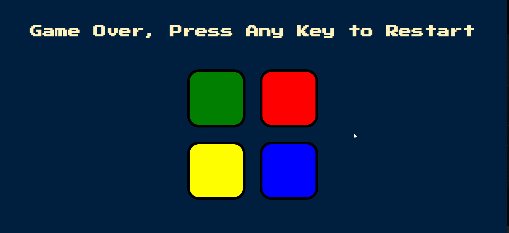

# 🎮 Simon Game (jQuery Version)

A fun memory game inspired by the classic **Simon Game**.  
The player must remember and repeat the sequence of colors that grows longer with each level.  
One wrong move and it’s game over!

---

## 🚀 Demo
*https://pouriavj.github.io/Simon-Game*

---

## 🛠️ Features
- Classic **Simon Game** mechanics  
- Randomly generated color sequences  
- Smooth button animations and sound effects  
- Built with **JavaScript** and **jQuery**  

---

## 🎯 How to Play
1. Press **any key on your keyboard** to start the game.  
2. Watch the sequence of colors that lights up.  
3. Click the buttons in the same order.  
4. Each level adds one more color to the sequence.  
5. If you make a mistake → **Game Over** (press any key to restart).  

**Note:** This version requires a keyboard to start the game, so it may not work on mobile devices without a physical or virtual keyboard.  

---

## 💻 Technologies Used
- HTML5  
- CSS3  
- JavaScript (ES6)  
- **jQuery**  

---

## 📷 Preview
**
